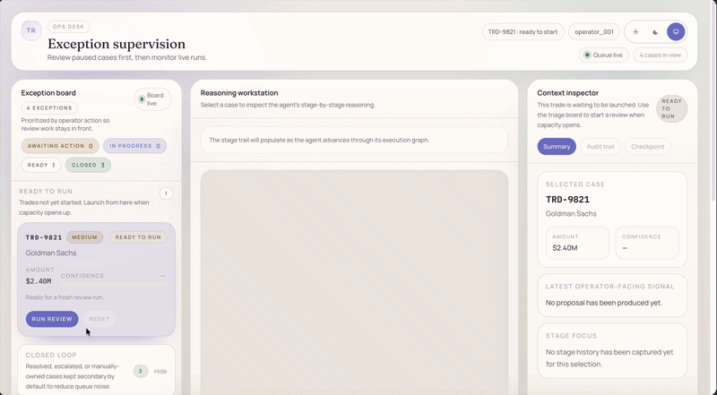

# Trade Exception Review Agent

A production-style **Human-in-the-Loop (HITL)** agent for reviewing trade exceptions.

The project pairs a **LangGraph + FastAPI backend** with a **Next.js supervision UI** and supports:

- investigates a flagged trade,
- proposes a resolution with confidence,
- pauses for human review,
- resumes from checkpoints,
- and handles low-confidence, missing-information, and recovery flows safely.

<p align="center">
  
</p>

## Capabilities

- Typed agent state and graph-based exception handling
- Live backend-to-frontend streaming over SSE
- Human approval, rejection, modification, and escalation decisions
- Checkpointed pause and resume for human-in-the-loop review
- Supervision queue with per-thread reasoning and operator context
- Confidence-aware review policy and guarded execution
- Information-request flows when the agent lacks source-of-truth inputs
- Recovery and manual-takeover paths for failed or stalled cases

## Tech stack

- **Backend:** Python, FastAPI, LangGraph, LangChain OpenAI
- **Frontend:** Next.js, React, TypeScript, Tailwind CSS
- **Interaction model:** SSE streaming + checkpointed resume

## Project structure

```text
backend/
  agent/           Agent graph, state, nodes, prompts, fixtures, policy
  api/             FastAPI routes, models, state store, audit store
  scripts/         Local validation and interactive scripts
frontend/
  app/             Next.js app routes
  components/      Supervision surface UI
  hooks/           Streaming and supervision state hooks
```

## Quick start

### 1. Backend setup

```bash
python3 -m venv .venv
source .venv/bin/activate
pip install -r backend/requirements.txt
cp backend/.env.example backend/.env
```

Set `OPENAI_API_KEY` in `backend/.env`.

### 2. Frontend setup

```bash
cd frontend
npm install
```

### 3. Run the app

From the repo root, start the backend:

```bash
source .venv/bin/activate
python -m uvicorn backend.main:app --host 127.0.0.1 --port 8000
```

In a second terminal, start the frontend:

```bash
cd frontend
npm run dev
```

Open:

- **Frontend:** `http://localhost:3000`
- **Backend health:** `http://127.0.0.1:8000/health`

## Demo trade IDs

Use these sample exceptions to exercise different flows:

- `TRD-9821` — standard review flow
- `TRD-9834` — forced low-confidence proposal
- `TRD-9841` — recoverable execution failure
- `TRD-9855` — information request before investigation can continue

## Validation

Backend:

```bash
source .venv/bin/activate
python -m compileall backend
```

Frontend:

```bash
cd frontend
npm run lint
npm run build
```
